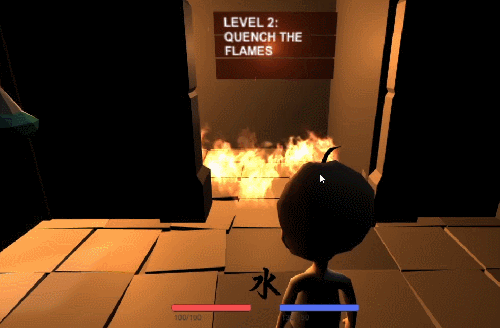
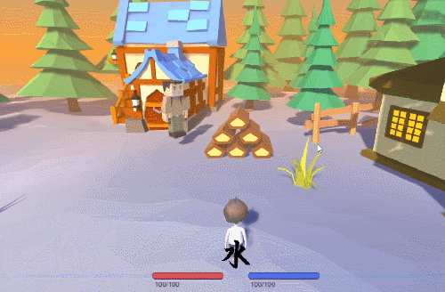

# Contaigon

3D Dungeon Exploration Game developed in a team at Georgia Tech for a Video Game Design course.
Fight enemies and solve puzzles by casting magic spells of three different elements, Earth, Water, and Fire!

## Play Now

Game is available to download and play for free on Windows, Mac, and Linux at 

  
  
  
  

## Features

### Control The Elements

Control the elements and switch between Fire, Water, and Earth as you cast elemental spells to overcome challenges.

### Solve The Puzzles

Navigate through the dungeon by using your elemental spells to solve a variety of different puzzles!

### Fight For Your Life

Blast your enemies with the power of the elements, and watch out for the Final Boss!

© Nathan Foote | 2016
